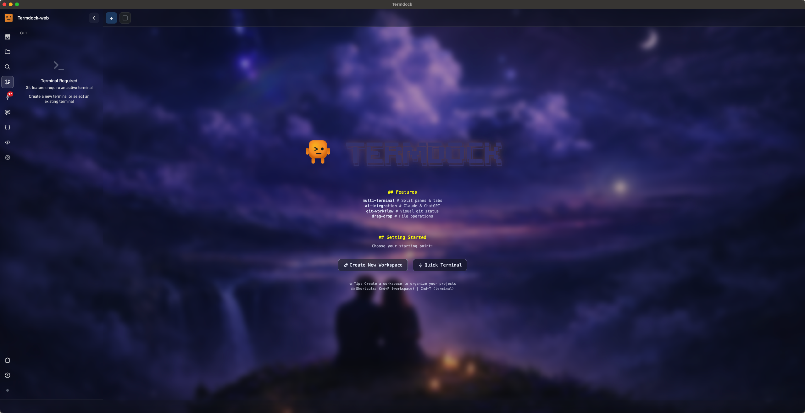
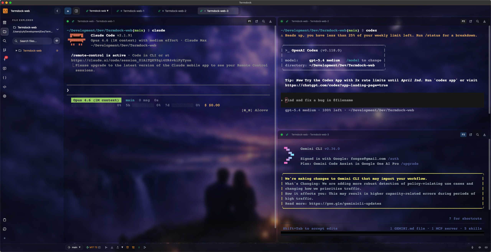
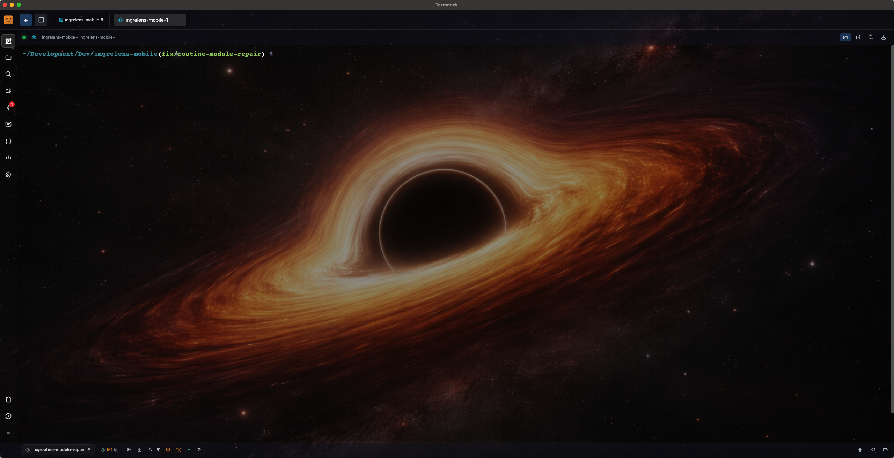

<div align="center">

# Termdock

**Terminal-Centric AI Development Environment**

*Unified workspace for AI CLI tools, multi-terminals, and Git workflows*

[](https://www.producthunt.com/products/termdock)

**Languages**: English | [繁體中文](README.zh-TW.md)

[Download](https://github.com/termdock/termdock-issues/releases/latest) • [Documentation](https://termdock.com/docs) • [Report Issue](https://github.com/termdock/termdock-issues/issues) • [Discussions](https://github.com/termdock/termdock-issues/discussions)

</div>

---

## Demo


**[▶ Watch full video on YouTube](https://www.youtube.com/watch?v=rjkPY-c4eMM)**

> **Note**: This repository is for **downloading Termdock releases** and **reporting issues**. Main development happens in a private repository.

## Important Notice: Intel Mac Users

If you're on an **Intel Mac** and experiencing terminal launch issues:

1. **Update to version 1.3.2+** - This fixes the ARM64 PTY loading issue
2. If errors persist, a dialog will display the full error log
3. Click "OK" to copy the log and [paste it in a GitHub issue](https://github.com/termdock/termdock-issues/issues)

**Download the correct DMG for your Mac:**
- Intel Mac → `Termdock-x.x.x.dmg`
- Apple Silicon → `Termdock-x.x.x-arm64.dmg`

---

## What is Termdock?

Termdock is a **terminal-centric AI development environment** that unifies AI CLI tools, workspace management, and Git workflows in one powerful interface. Built for developers who live in the terminal but want the power of modern development tools.

### Why Termdock?

- **AI-First Design** - Seamlessly integrate Claude Code, Cursor AI, Aider, and other AI CLI tools
- **AST-Powered Code Search** - Tree-sitter integration for 13+ programming languages with intelligent symbol analysis
- **Multi-Workspace Management** - Handle multiple projects and repositories with instant context switching
- **Smart Terminal** - Split views, tab management, and session persistence built-in
- **Highly Customizable** - Themes, backgrounds, layouts - make it yours

---

## Screenshots

<div align="center">

### AST-Powered Code Analysis
*Intelligent symbol search and dependency visualization across 13+ languages*



### Multi-Terminal Workspace
*Manage multiple terminals, repositories, and AI tools in one unified interface*



### Theme Customization
*Dark mode, light mode, and custom backgrounds - personalize your workspace*



</div>

---

## Core Features

### Smart Terminal Management
- Multi-tab interface with independent Shell sessions
- Quick tab switching (Cmd+1-9)
- Drag-and-drop tab reordering
- Automatic session recovery
- Split view support:
  - Horizontal split (Cmd+D)
  - Vertical split (Cmd+Shift+D)
  - Flexible pane resizing
- Picture-in-picture window mode
- Quick workspace switching (Cmd+P)
- Terminal grouping by workspace

### AST Code Analysis (BETA)
- Tree-sitter integration supporting **13+ programming languages**:
  - JavaScript, TypeScript, Python, Rust, Go
  - C, C++, Java, Ruby, PHP, Swift
  - And more...
- Intelligent symbol reference finding
- Dependency analysis and visualization
- Function call graph generation
- Precise code navigation

### AI CLI Tools Integration
- Optimized workflows for:
  - Claude Code
  - Cursor AI
  - Aider
  - GitHub Copilot CLI
  - And any terminal-based AI tool
- Large context paste with compression logging
- AI-generated commit messages (BYOK)

### Git & File Management
- Complete Git integration with visual branch management
- Full-featured file explorer
- Clipboard image auto-processing
- Drag-and-drop file upload with validation
- Full-text search and fuzzy filename matching

### Developer Experience
- Dynamic theme system with custom backgrounds
- Global hotkey support
- Fast, native macOS performance
- Lightweight and responsive

---

## What's Coming Next

### In Development (v1.4.0 ～ ... )
- **Windows Support** - Native Windows build with full terminal and AST support *(35% complete, ETA: Late November 2025)*

### Planned Features
- **Public AST API** - REST/GraphQL API for external integrations and LSP support
- **Plan Mode with CLI** - Interactive planning mode integrated with AI CLI workflows
- **CLI Control Interface** - Command-line interface to automate Termdock operations
- **UI Enhancements & i18n** - Panel-based code viewer, Japanese & Korean language support
- **Linux Support** - Native builds for Debian/Ubuntu and AppImage

[View Full Roadmap](https://termdock.com/roadmap) • [Feature Requests](https://github.com/termdock/termdock-issues/discussions)

---

## Download & Installation

### Homebrew (Recommended)
```bash
brew tap termdock/termdock-issues https://github.com/termdock/termdock-issues
brew install --cask termdock
```

### Manual Download

**Latest Release**: [Download Here](https://github.com/termdock/Termdock-issues/releases/latest)

**macOS Requirements**
- macOS 10.14+ (Monterey or later recommended)
- Intel or Apple Silicon processor

**Installation Steps**
1. Download the appropriate DMG for your Mac:
   - **Intel Mac**: `Termdock-x.x.x.dmg`
   - **Apple Silicon**: `Termdock-x.x.x-arm64.dmg`
2. Open the DMG file and drag Termdock to Applications folder
3. First launch may require allowing the app in:
   - `System Preferences` → `Security & Privacy`

**Platform Availability**
- macOS (Intel & Apple Silicon)
- Windows (Coming Soon)
- Linux (Coming Soon)

---

## Bug Reports & Feature Requests

Found a bug or have an idea? We'd love to hear from you!

[**Create an Issue**](https://github.com/termdock/termdock-issues/issues) | [**Start a Discussion**](https://github.com/termdock/termdock-issues/discussions)

### Before Reporting
- Check if the issue already exists
- Try the latest version
- Include:
  - macOS version
  - Termdock version
  - Steps to reproduce
  - Error logs (if applicable)

---

## Community & Support

- **Issues**: [GitHub Issues](https://github.com/termdock/Termdock-issues/issues)
- **Discussions**: [GitHub Discussions](https://github.com/termdock/Termdock-issues/discussions)
- **Documentation**: [termdock.com/docs](https://termdock.com/docs)
- **Website**: [termdock.com](https://termdock.com)

---

## Stay Updated

Follow this repository to get notified of new releases:
1. Click **Watch** at the top
2. Select **Custom** → **Releases**

---

## Version Information

- **Stable Releases**: Production-ready updates
- **Development Releases**: Preview versions with latest features
- **System Requirements**: macOS 10.14+ (Monterey or later recommended)

---

<div align="center">

**Termdock - Making AI Development Smarter and More Efficient**

Built for developers who live in the terminal

[Website](https://termdock.com) • [Download](https://github.com/termdock/termdock-issues/releases/latest) • [Docs](https://termdock.com/docs)

</div>
