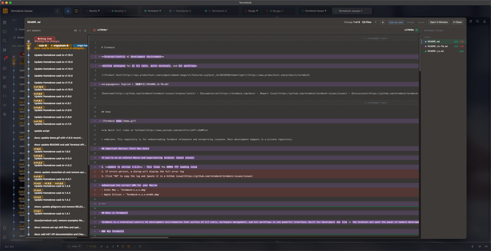

<div align="center">

# Termdock

**Let AI Write the Code. You Own the View.**

*An AI-native terminal for macOS & Windows — hand your work to Claude Code, Codex, Gemini, or GitLab Duo, supervise everything from one GPU-accelerated workspace, and make every pixel of the backdrop yours.*

[](https://www.producthunt.com/products/termdock)

**Languages**: English | [繁體中文](README.zh-TW.md) | [日本語](README.ja.md)

[Download](https://github.com/termdock/termdock-issues/releases/latest) • [Documentation](https://termdock.com/docs) • [Report Issue](https://github.com/termdock/termdock-issues/issues) • [Discussions](https://github.com/termdock/termdock-issues/discussions)

</div>

---

## Demo


**[▶ Watch full video on YouTube](https://www.youtube.com/watch?v=rjkPY-c4eMM)**

> **Note**: This repository is for **downloading Termdock releases** and **reporting issues**. Main development happens in a private repository.

---

## What is Termdock?

The way we build software has changed: the agent writes, you direct. Termdock is a **terminal-first development environment for macOS and Windows** built around that reality — a fast, GPU-accelerated terminal emulator where **Claude Code, Codex, Gemini CLI, and GitLab Duo** run as first-class sessions, their permission requests land in an approval panel instead of scrolling past, and their output gets verified with code intelligence and visual Git review. Meanwhile, the screen you stare at all day is entirely yours: custom background images, themes, fonts, translucent chrome.

### Why Termdock?

- **AI-agent native** — first-class sessions for Claude Code, Codex, Gemini CLI, and GitLab Duo; agents work in the background by default and never steal your pane
- **You stay in command** — permission requests, questions, and plan reviews become cards you approve or deny from a dedicated panel, even from your phone
- **Verify what the AI wrote** — a framework-aware code graph, diff impact analysis, and a visual three-pane Git review with blame and Twin Focus highlighting
- **The view is yours** — custom background images, dark/light themes, custom fonts, translucent glass chrome
- **Fast and power-efficient** — WebGL (GPU) rendering cuts renderer CPU by ~90% under heavy output, with automatic power-saving on battery

---

## ✨ New in v1.16

- **Git Review, rebuilt** — three-pane visual diff review with blame, Twin Focus token highlighting, and read-only merge / conflict review
- **Dock parking** — drag a terminal session into the dock: hidden but alive, notifications keep piling up
- **Drop a folder, get a workspace** — instant workspace creation by drag-and-drop
- **A code graph that knows your framework** — Express / Fastify / Koa / FastAPI / Flask routes as first-class nodes, plus diff impact analysis for any change
- **Native Rust indexing pipeline** — noticeably faster on large projects
- **GitLab Duo joins the agent roster** — alongside Claude Code, Codex, and Gemini

[Full release notes →](https://github.com/termdock/termdock-issues/releases/latest)

---

## Screenshots

<div align="center">

### Visual Git Review — New in v1.16
*Three-pane diff review with blame, cross-file navigation, and Twin Focus token highlighting*



### Code Intelligence
*Symbol search, call graphs, and dependency visualization across 13+ languages*


### Multi-Terminal Workspace
*Terminals, file previews, repositories, and AI agents in one unified grid*


### Theme Customization
*Dark mode, light mode, custom backgrounds and fonts — your terminal, your view*


</div>

---

## Features

### Hand Off the Work

Stop babysitting terminal scrollback. In Termdock, **Claude Code, Codex, Gemini CLI, and GitLab Duo** run as managed agent sessions — in the background by default, so your pane stays yours while they grind.

- **Agent Workstream** — permission requests, questions, and plan reviews are intercepted into structured cards; approve, deny, or answer from a dedicated panel. `termdock hooks setup` wires everything in one command
- **Terminal API** — a local HTTP API for agents and scripts: create, control, and read terminal sessions (including headless ones), stream output in real time via SSE, authenticate with service tokens and rate limiting. [API Documentation](https://termdock.com/docs/terminal-api)
- **`termdock` CLI** — create, attach, and follow sessions or query the focused workspace from any shell script
- **Voice input** via Whisper, **AI-generated commit messages** (BYOK), and installable **Claude Code Skills** for Termdock's AST and Terminal APIs

### Own the View

The agents may write the code, but the screen you stare at eight hours a day is yours. Put **your own image behind your terminal** — Termdock tints an automatic readability scrim from the picture's own colors, so the text stays crisp and the art stays visible.

- **Dynamic theme system** — dark mode, light mode, and per-theme accent colors across the entire app
- **Custom terminal fonts** — including custom font search paths beyond system locations
- **Translucent glass chrome** — unified across terminal panes and in-pane file viewers
- **Discord Rich Presence** — show Termdock activity in your Discord status

### A Terminal That Stays Fast

Agents produce a firehose of output. Termdock renders it with **WebGL (GPU)** instead of laying out every cell in the DOM — renderer CPU under heavy output drops by roughly 90% — and an **automatic power-saving mode** dials things back on battery and lets the GPU loose when you're plugged in.

- **Session restore** — quit the app, come back, and every terminal is exactly where you left it
- **Split panes & tabs** — horizontal (Cmd+D) and vertical (Cmd+Shift+D) splits, drag-and-drop reordering, quick switching (Cmd+1–9), picture-in-picture mode
- **Dock parking** — drag a terminal you're not watching into the dock: no pane, no tab-strip slot, notifications keep piling up, and it's ready whenever you are
- **Background & headless terminals** — long-running shells keep full screen state without a visible pane

### Output You Can Actually Click

Every command's output range and working directory are tracked through shell integration (OSC 133), so file paths in your output just work: git diff prefixes are cleaned up, wrapped long paths are reassembled, and relative paths resolve against the directory the command actually ran in.

- **Listening port badges** — see which ports your workspace services are listening on, live in the sidebar, no more `lsof`
- **Host detection** — Termdock knows whether each session is local, over SSH, or inside a container

### Verify What the AI Wrote

"Done!" says the agent. Termdock helps you check. A **native Rust indexing pipeline** builds a code graph that goes beyond functions and classes — it understands your web framework — and maps any diff back to its blast radius.

- **Diff impact analysis** — a git diff maps onto the code graph and walks back to affected callers, so you know what the agent's change actually touches before you accept it
- **Framework route nodes** — routes in Express, Fastify, Koa, FastAPI, and Flask become first-class graph nodes, traceable from route to handler to middleware
- **Tree-sitter + LSP** across **13+ languages** — JavaScript, TypeScript, Python, Rust, Go, C, C++, Java, Ruby, PHP, Swift, and more
- **Code Graph MCP server** — expose your codebase structure to Claude Code, Codex, Cursor, and any MCP-compatible tool

### Review Git Where You Work

The final check before you ship what the agent built — without bouncing to a browser. Termdock ships a **visual Git review surface**: three-pane layout with blame, cross-file navigation, and smooth handling of large files.

- **Twin Focus** — corresponding tokens highlight on both sides at once, so renames line up at a glance
- **Read-only merge / conflict review**, visual branch management, and colors that follow your theme

### Workspaces Without Ceremony

Drop a folder onto Termdock and you have a workspace. Tag it, and the sidebar and quick switcher (Cmd+P) group everything automatically.

- **File previews inside panes** — Markdown, code, JSON/YAML/XML, PDF, and images open in the same grid as terminals, with the same tabs and drag-and-drop rules
- Full-featured file explorer, fuzzy search with `*`/`?` wildcards, Markdown export to standalone HTML

### Supervise From Your Pocket

The agent doesn't stop when you leave the desk — and neither does your oversight. Control terminals remotely from **Telegram or Discord**: send input, read output, get notified when background terminals produce output (/watch), and grab screenshots (/snap). [Setup Guide](https://termdock.com/docs/remote-control)

---

## What's Coming Next

### v1.17 — Agent Ecosystem (in progress)

- **OpenCode integration** — OpenCode joins Claude Code, Codex, and Gemini as the fourth agent session provider, with HTTP + SSE daemon client and interactive terminal sessions
- **ACP / AI API provider options** — expanded provider configuration

### Beyond (v1.18+)

- **Remote / browser access** — reach your terminals from outside the desktop app
- **Multi-Git repository workspaces** — mount multiple repos under a single workspace
- **Windows native Rust PTY**
- **Linux support**

[View Full Roadmap](https://termdock.com/roadmap) • [Feature Requests](https://github.com/termdock/termdock-issues/discussions)

---

## Download & Installation

### macOS — Homebrew (Recommended)

```bash
brew tap termdock/termdock-issues https://github.com/termdock/termdock-issues
brew install --cask termdock
```

### Manual Download

**Latest Release**: [Download Here](https://github.com/termdock/termdock-issues/releases/latest)

| Platform | File |
|---|---|
| macOS (Apple Silicon, recommended) | `Termdock-x.x.x-arm64.dmg` |
| macOS (Intel) | `Termdock-x.x.x.dmg` |
| Windows | `Termdock.Setup.x.x.x.exe` |
| Linux | Coming soon |

**macOS Requirements**: macOS 10.14 or later, Intel or Apple Silicon (M1/M2/M3/M4 recommended)

**macOS Installation**
1. Download the appropriate DMG for your Mac
2. Open the DMG file and drag Termdock to Applications folder
3. First launch may require allowing the app in `System Preferences` → `Security & Privacy`

> **Intel Mac users**: if the terminal fails to launch, update to version 1.3.2+ (fixes an ARM64 PTY loading issue). If errors persist, click "OK" on the error dialog to copy the log and [paste it in a GitHub issue](https://github.com/termdock/termdock-issues/issues).

---

## Bug Reports & Feature Requests

Found a bug or have an idea? We'd love to hear from you!

[**Create an Issue**](https://github.com/termdock/termdock-issues/issues) | [**Start a Discussion**](https://github.com/termdock/termdock-issues/discussions)

### Before Reporting

- Check if the issue already exists
- Try the latest version
- Include:
  - OS and version (macOS / Windows)
  - Termdock version
  - Steps to reproduce
  - Error logs (if applicable)

---

## Community & Support

- **Issues**: [GitHub Issues](https://github.com/termdock/termdock-issues/issues)
- **Discussions**: [GitHub Discussions](https://github.com/termdock/termdock-issues/discussions)
- **Documentation**: [termdock.com/docs](https://termdock.com/docs)
- **Website**: [termdock.com](https://termdock.com)

---

## Stay Updated

Follow this repository to get notified of new releases:
1. Click **Watch** at the top
2. Select **Custom** → **Releases**

---

<div align="center">

**Termdock — let AI write the code; the view stays yours**

For developers who delegate the work, not the taste

[Website](https://termdock.com) • [Download](https://github.com/termdock/termdock-issues/releases/latest) • [Docs](https://termdock.com/docs)

</div>
