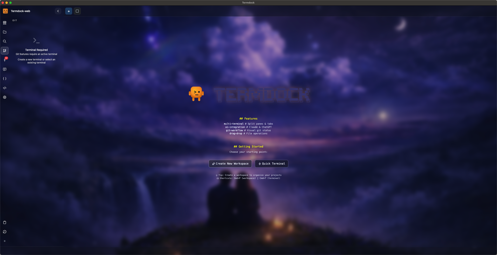
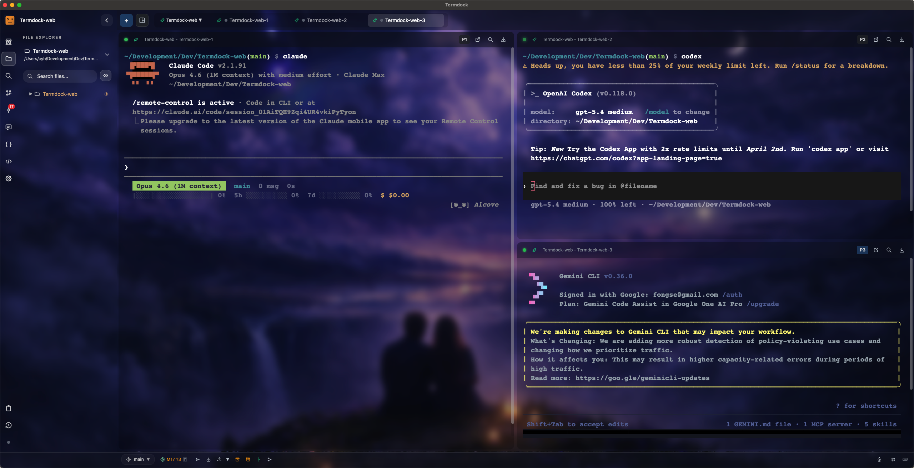
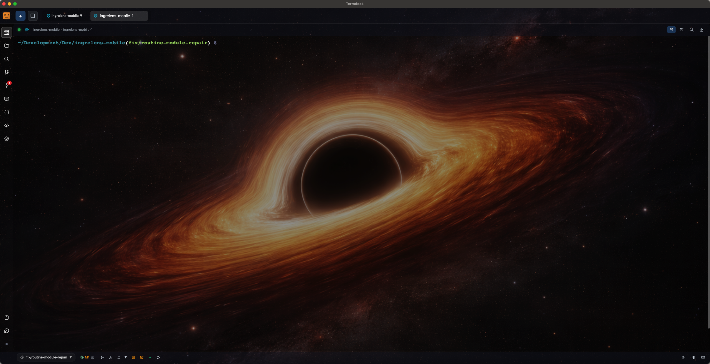

<div align="center">

# Termdock

**以終端為中心的 AI 開發環境**

*整合 AI CLI 工具、多終端管理與 Git 工作流的統一工作區*

[](https://www.producthunt.com/products/termdock)

**語言**: [English](README.md) | 繁體中文

[下載](https://github.com/termdock/termdock-issues/releases/latest) • [文件](https://termdock.com/docs) • [回報問題](https://github.com/termdock/termdock-issues/issues) • [討論區](https://github.com/termdock/termdock-issues/discussions)

</div>

---

## 展示影片


**[▶ 在 YouTube 觀看完整影片](https://www.youtube.com/watch?v=rjkPY-c4eMM)**

> **注意**: 此 repository 用於**下載 Termdock 安裝檔**與**回報問題**。主要開發在私有 repository 進行。

## 重要公告：Intel Mac 使用者

如果您使用 **Intel Mac** 並遇到終端機無法啟動的問題：

1. **更新至 1.3.2 以上版本** - 此版本修復了 ARM64 PTY 載入問題
2. 若錯誤持續發生，系統會顯示完整錯誤日誌對話框
3. 點擊「確定」複製日誌，並[貼到 GitHub issue](https://github.com/termdock/termdock-issues/issues)

**請下載對應您 Mac 的正確 DMG 檔案：**
- Intel Mac → `Termdock-x.x.x.dmg`
- Apple Silicon → `Termdock-x.x.x-arm64.dmg`

---

## 什麼是 Termdock？

Termdock 是一個**以終端為中心的 AI 開發環境**，將 AI CLI 工具、工作區管理與 Git 工作流整合在單一強大介面中。專為終端生活的開發者打造，同時擁有現代開發工具的強大功能。

### 為什麼選擇 Termdock？

- **AI 優先設計** - 無縫整合 Claude Code、Cursor AI、Aider 及其他 AI CLI 工具
- **AST 驅動的程式碼搜尋** - Tree-sitter 整合支援 13+ 種程式語言與智慧符號分析
- **多工作區管理** - 同時處理多個專案與 repository，瞬間切換環境
- **智慧終端** - 內建分割視窗、標籤管理與 session 保存
- **高度客製化** - 主題、背景、版面配置 - 打造專屬工作環境

---

## 螢幕截圖

<div align="center">

### AST 驅動的程式碼分析
*支援 13+ 種語言的智慧符號搜尋與相依性視覺化*



### 多終端工作區
*在單一統一介面中管理多個終端、repository 與 AI 工具*



### 主題客製化
*深色模式、淺色模式與自訂背景 - 個人化您的工作區*



</div>

---

## 核心功能

### 智慧終端管理
- 多標籤介面，每個標籤獨立的 Shell session
- 快速切換標籤（Cmd+1-9）
- 拖放重新排序標籤
- **Session 還原** - 應用程式重啟後自動恢復所有終端
- 分割視窗支援：
  - 水平分割（Cmd+D）
  - 垂直分割（Cmd+Shift+D）
  - 彈性調整分割窗格大小
- 子母畫面視窗模式
- 快速切換工作區（Cmd+P）
- 依工作區分組終端

### 遠端終端控制
- **Telegram bot** - 手機操控終端：/ws、/new、/send、/read、/watch、/key、/snap
- **Discord bot** - 斜線指令搭配互動按鈕提示，支援 CLI 選項選擇
- **/watch** - 背景終端產生輸出時推播通知
- **/snap** - 單一 session 或整個視窗截圖
- [設定指南](https://termdock.com/docs/remote-control)

### Terminal API（Agent 整合）
- 本地 HTTP API 讓 AI agent 建立並操控終端 session
- 輪詢式輸出讀取，支援 cursor-based 增量更新
- 輸出模式：text（去除 ANSI）、raw、content（過濾 TUI chrome）
- Bearer token 認證搭配速率限制
- [API 文件](https://termdock.com/docs/terminal-api)

### AST 程式碼分析
- Tree-sitter + **LSP 整合**支援 **13+ 種程式語言**：
  - JavaScript、TypeScript、Python、Rust、Go
  - C、C++、Java、Ruby、PHP、Swift
  - 以及更多...
- 智慧符號引用查找
- 相依性分析與視覺化
- 函數呼叫圖生成
- 精確程式碼導航

### AI CLI 工具整合
- 針對以下工具最佳化工作流程：
  - Claude Code
  - Cursor AI
  - Aider
  - GitHub Copilot CLI
  - 以及任何終端型 AI 工具
- 大量內容貼上與壓縮記錄
- AI 生成 commit 訊息（BYOK）
- **語音輸入** - 透過 Whisper 語音轉文字
- **Claude Code Skills** - 從設定安裝 Skills，教導 Claude Code 如何使用 Termdock 功能：
  - **Termdock AST Skill** - 透過 REST API 查詢程式碼結構、搜尋符號、分析相依性
  - **Termdock Terminal API Skill** - Agent 操控終端 session

### Git 與檔案管理
- 完整 Git 整合與視覺化分支管理
- 功能完整的檔案總管
- 剪貼簿圖片自動處理
- 拖放檔案上傳與驗證
- 全文搜尋與模糊檔名比對

### 開發者體驗
- 動態主題系統與自訂背景
- **Discord Rich Presence** - 在 Discord 狀態顯示 Termdock 活動
- 全域快捷鍵支援
- 快速、原生 macOS 效能
- 輕量且反應靈敏

---

## 即將推出

### 規劃中（Q2-Q3 2026）
- **Project Aurora** - 以 Rust 重寫程式碼分析引擎，實現平行檔案掃描與解析
- **多 Git 倉庫支援** - 單一工作區掛載多個 Git 倉庫，自動上下文切換
- **Terminal API 進階整合** - Agent 協作協定、外部工具查詢與控制
- **macOS 預設檔案閱讀器** - 從 Finder 直接開啟 Markdown、JSON、YAML 檔案
- **Linux 支援** - Debian/Ubuntu 原生套件與 AppImage

[查看完整路線圖](https://termdock.com/roadmap) • [功能建議](https://github.com/termdock/termdock-issues/discussions)

---

## 下載與安裝

### Homebrew（推薦）
```bash
brew tap termdock/termdock-issues https://github.com/termdock/termdock-issues
brew install --cask termdock
```

### 手動下載

**最新版本**: [點此下載](https://github.com/termdock/Termdock-issues/releases/latest)

**macOS 系統需求**
- macOS 10.14 或更新版本
- Intel 或 Apple Silicon 處理器
- **建議硬體**: Apple Silicon (M1/M2/M3/M4) 以獲得最佳效能

**安裝步驟**
1. 下載對應您 Mac 的 DMG 檔案：
   - **Intel Mac**: `Termdock-x.x.x.dmg`
   - **Apple Silicon**: `Termdock-x.x.x-arm64.dmg`
2. 開啟 DMG 檔案並將 Termdock 拖曳至應用程式資料夾
3. 首次啟動可能需要在以下位置允許應用程式：
   - `系統偏好設定` → `安全性與隱私權`

**平台支援狀況**
- macOS（Intel 與 Apple Silicon）
- Windows
- Linux（即將推出）

---

## 問題回報與功能建議

發現 bug 或有想法？我們很樂意聽到您的意見！

[**建立 Issue**](https://github.com/termdock/termdock-issues/issues) | [**開始討論**](https://github.com/termdock/termdock-issues/discussions)

### 回報前請確認
- 檢查問題是否已存在
- 嘗試最新版本
- 包含以下資訊：
  - macOS 版本
  - Termdock 版本
  - 重現步驟
  - 錯誤日誌（若適用）

---

## 社群與支援

- **問題回報**: [GitHub Issues](https://github.com/termdock/Termdock-issues/issues)
- **討論區**: [GitHub Discussions](https://github.com/termdock/Termdock-issues/discussions)
- **文件**: [termdock.com/docs](https://termdock.com/docs)
- **官網**: [termdock.com](https://termdock.com)

---

## 接收更新通知

關注此 repository 以接收新版本通知：
1. 點擊上方 **Watch**
2. 選擇 **Custom** → **Releases**

---

## 版本資訊

- **穩定版本**: 正式發布的更新版本
- **開發版本**: 包含最新功能的預覽版本
- **系統需求**: macOS 10.14 以上，建議使用 Apple Silicon

---

<div align="center">

**Termdock - 讓 AI 開發更智慧、更高效**

專為終端生活的開發者打造

[官網](https://termdock.com) • [下載](https://github.com/termdock/termdock-issues/releases/latest) • [文件](https://termdock.com/docs)

</div>
